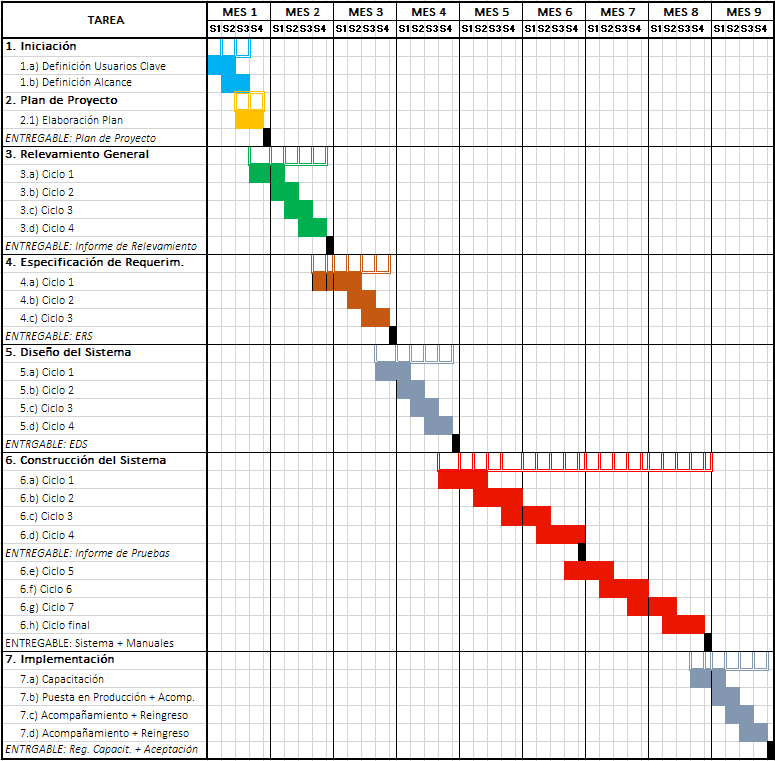

|  | ***TRIADE SA - SISTEMA DE DISTRIBUCION DE DIARIOS Y REVISTAS*** |
|:----------------------------|:----------------------------------------------------------------|
| **INFORME DE RELEVAMIENTO** |                                                                 |

| MINUTA                    |     MP.COMERCIO.IDR.20161103-01.doc  |
|--------------------------	|------------------------------------------|
| AUTOR DEL INFORME       	| Lic. Juan Manuel Fragueiro               |
| FECHA DEL INFORME     	| 03-11-2016                               |
| PARTICIPANTES DEL EQUIPO 	| Juan Manuel Fragueiro (JMF), Luis Antonio Rios (LAR)                          |

***
1. **INTRODUCCION**

    El Objetivo principal del este informe es obtener y validar una visión detallada del dominio asociado a la Tasa de Comercio en la Municipalidad de Posadas a fin de lograr, para cada función o módulo abarcado, los siguientes resultados:
    •	establecer su alcance y límites específicos,
    •	verificar los objetivos planteados,
    •	describir el estado actual (funcional, de infraestructura, de capacidades, etc.) de los sectores involucrados y su afectación,
    •	determinar las necesidades que se requiere sean cubiertas,
    •	identificar con exactitud las distintas fuentes de información a utilizarse,
    •	establecer las interfases responsables del intercambio de información,
    •	precisar los planes y cronogramas de tareas.

    Esto permitirá utilizar el presente informe como una fuente de asesoramiento sobre el dominio y los procesos existentes en la Dirección de Comercio y sobre las necesidades de actualización, ampliación o modernización que sean determinadas como necesarias para la implementación del Sistema objeto de éste proyecto.

    Se busca además asegurar una planificación general del proyecto lo más ajustada posible y la identificación y disponibilidad de todos los elementos necesarios, que tengan impacto de magnitud en el proyecto, para prever y evitar la ocurrencia de demoras en la ejecución del mismo.

	**++1.1 Tareas Realizadas++** 
    El trabajo se desarrolló según nuestra metodología de Ingeniería de Requerimientos, de acuerdo con las Pautas de Control Interno para Procesos y Sistemas de Información  aplicables a la evaluación de las actividades de control y procesamiento de la información.
    Dentro del marco propuesto, las tareas realizadas pueden clasificarse en dos grupos:

		1.1.1	Obtención de información general
    La revisión se llevó a cabo mediante entrevistas con el personal encargado de las funciones vinculadas con el procesamiento de la información y el gerenciamiento de las áreas bajo estudio. Se describieron los procesos fundamentales del sector, y se realizó el análisis de los formularios y la documentación relacionada.
    Las reuniones se practicaron en un enfoque de entrevista de comienzo y final abierto, y se permitió al entrevistado que hable informalmente de su tarea y su sector, y de cómo el sistema actual hace frente a las necesidades funcionales del mismo.
    También se buscó obtener copias de los diversos formularios utilizados dentro de los sectores, de manera de poder aplicarlos luego en un enfoque de relevamiento de análisis de formularios en búsqueda de una mejor compresión del dominio, sus procesos de negocio y el modelo de datos que actualmente lo soporta.

		1.1.2	Evaluación de los procesos de Tecnología de la Información
    Se evaluaron los procesos y recursos vigentes relacionados con la tecnología informática. Se observaron y controlaron ejemplos prácticos de las funciones del sistema en producción. Estos controles se refieren al ambiente general que sustenta el procesamiento de todos los módulos de la aplicación, capacidad de cumplimiento de los requerimientos actuales y futuros y a los controles mínimos implementados para asegurar que el funcionamiento de sus componentes sea eficiente, confiable y seguro.
    Las consultas sobre el sistema actual se realizaron con el objetivo de validar la posibilidad de utilizarlo como herramienta de relevamiento más profundo en un enfoque de relevamiento de reuso de requerimientos por ingeniería reversa, aprovechando la disponibilidad y utilización del sistema actual.

	**++1.2	Áreas involucradas++** 
    Las áreas, dentro de la Municipalidad de Posadas, que fueron evaluadas como parte del desarrollo del presente informe son:
    •	Dirección de Comercio
    •	Dirección de Desarrollo de Sistemas
    •	Sector de Mesa de Entradas y Salidas (Despacho)
    •	Sector de Sistemas de Información
    Cabe aclarar que muchas de las reuniones efectuadas involucraron la participación de personal de la Dirección y/o bien de varias áreas ajenas a la objeto de la reunión, ya sea por la necesidad de comunicar cuestiones del proyecto en forma conjunta o bien por la conveniencia de verificar aspectos del funcionamiento de dichas áreas en forma cruzada y con el aporte de visiones de diferentes sectores.

2. **SITUACIÓN RELEVADA Y CONSIDERACIONES GENERALES**
Presentación y temario abierto sobre primeros conceptos importantes del dominio.

3. **ALCANCE DEL SISTEMA**
de personal de la Dirección y/o bien de varias áreas ajenas a la objeto de la reunión, ya sea por la necesidad de comunicar cuestiones del proyecto en forma conjunta o bien por la conveniencia de verificar aspectos del funcionamiento de dichas áreas en forma cruzada y con el aporte de visiones de diferentes sectores.

4. **DEFINICIÓN DE RESPONSABILIDADES**
de personal de la Dirección y/o bien de varias áreas ajenas a la objeto de la reunión, ya sea por la necesidad de comunicar cuestiones del proyecto en forma conjunta o bien por la conveniencia de verificar aspectos del funcionamiento de dichas áreas en forma cruzada y con el aporte de visiones de diferentes sectores.

5. **CRONOGRAMA DE ACTIVIDADES**
de personal de la Dirección y/o bien de varias áreas ajenas a la objeto de la reunión, ya sea por la necesidad de comunicar cuestiones del proyecto en forma conjunta o bien por la conveniencia de verificar aspectos del funcionamiento de dichas áreas en forma cruzada y con el aporte de visiones de diferentes sectores.

***

Por el Equipo de Desarrollo 
 **Lic. Juan Manuel Fragueiro** 
 **ASI Luis Antonio Ríos** 

